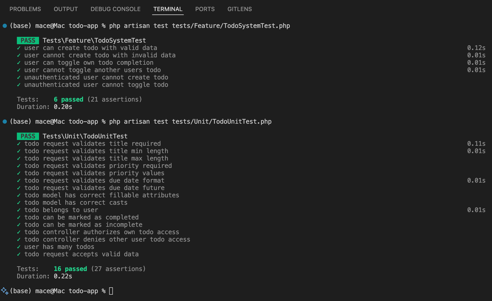

# Test Plan for Laravel Todo Application

## 1. User Stories to Test

### User Story 1: Create Todo
**As a** logged-in user  
**I want to** create a new todo item  
**So that** I can track tasks I need to complete

**Paths:**
- **Happy Path**: User successfully creates a todo with valid data
- **Unhappy Path**: User attempts to create a todo with invalid data (missing title, invalid due date, invalid priority)

### User Story 2: Toggle Todo Completion
**As a** logged-in user  
**I want to** mark my todos as complete or incomplete  
**So that** I can track my progress on tasks

**Paths:**
- **Happy Path**: User successfully toggles a todo from incomplete to complete
- **Unhappy Path**: User attempts to toggle a todo they don't own (unauthorized access)

## 2. System Tests Description

### User Story 1: Create Todo

#### Happy Path System Test
- **Scenario**: User creates a todo with valid data
- **Coverage**: 
  - User authentication
  - Form submission with valid data
  - Database storage
  - Redirect to todo list
  - Success message display

#### Unhappy Path System Test
- **Scenario**: User attempts to create a todo with invalid data
- **Coverage**:
  - Form validation errors
  - Error message display
  - Form data persistence
  - No database insertion

### User Story 2: Toggle Todo Completion

#### Happy Path System Test
- **Scenario**: User toggles their own todo completion status
- **Coverage**:
  - User authentication
  - Todo ownership verification
  - Database update
  - Redirect to todo list
  - Success message display

#### Unhappy Path System Test
- **Scenario**: User attempts to toggle another user's todo
- **Coverage**:
  - Authorization check
  - 403 Forbidden response
  - No database changes

## 3. Unit Tests Description

### User Story 1: Create Todo

#### Unit Test Coverage
- **TodoRequest Validation**: Test validation rules for title, description, due_date, and priority
- **Todo Model**: Test fillable attributes and relationships
- **TodoController Store Method**: Test successful todo creation logic

### User Story 2: Toggle Todo Completion

#### Unit Test Coverage
- **Todo Model**: Test completion status updates
- **TodoController ToggleComplete Method**: Test authorization and update logic
- **User-Todo Relationship**: Test ownership verification

## 4. V-Model Application

### User Story 1: Create Todo
- **Requirements Level**: User can create todos with title, description, due date, and priority
- **System Level**: TodoController handles creation, validation, and storage
- **Integration Level**: Form submission, validation, database interaction
- **Unit Level**: Individual components (TodoRequest, Todo model, TodoController methods)

### User Story 2: Toggle Todo Completion
- **Requirements Level**: User can mark todos as complete/incomplete
- **System Level**: TodoController handles toggle with authorization
- **Integration Level**: Toggle action, authorization check, database update
- **Unit Level**: Individual components (Todo model updates, authorization logic) 

## 5. Completed Tests Screenshot

# Testing Evaluation for Laravel Todo Application

## a. Possible Mistake/Error That Can Be Detected by Our Tests

This test suite can detect several types of errors and mistakes:

### 1. **Validation Errors (Detectable)**
- **Missing required fields**: Tests verify that todos cannot be created without a title or priority
- **Invalid data formats**: Tests catch invalid due dates (past dates, malformed dates)
- **Data length violations**: Tests ensure titles are between 3-255 characters and descriptions don't exceed 1000 characters
- **Invalid enum values**: Tests verify that priority must be one of: 'low', 'medium', 'high'

### 2. **Authorization Errors (Detectable)**
- **Cross-user access**: Tests verify that users cannot toggle, edit, or delete todos belonging to other users
- **Unauthenticated access**: Tests ensure that unauthenticated users are redirected to login when trying to access protected routes

### 3. **Database Integrity Errors (Detectable)**
- **Failed database operations**: Tests verify that todos are actually stored in the database after creation
- **Incorrect data persistence**: Tests ensure that todo status changes are properly saved
- **Relationship integrity**: Tests verify that todos are properly associated with their owners

### 4. **Business Logic Errors (Detectable)**
- **Incorrect status toggling**: Tests verify that completion status properly toggles between true/false
- **Wrong redirects**: Tests ensure users are redirected to the correct pages after operations
- **Missing success messages**: Tests verify that appropriate feedback is provided to users

## b. Possible Mistake/Error That Cannot Be Detected by Our Tests

Several types of errors and mistakes cannot be detected by our current test suite:

### 1. **Performance Issues (Undetectable)**
- **Slow database queries**: Tests don't measure query performance or identify N+1 problems
- **Memory leaks**: No tests for memory usage or resource cleanup
- **Scalability problems**: Tests don't verify behavior under high load or with large datasets
- **Caching issues**: No tests for cache invalidation or cache-related bugs

### 2. **Data Consistency Issues (Undetectable)**
- **Race conditions**: Tests don't simulate concurrent user access
- **Data corruption**: No tests for database corruption scenarios
- **Transaction rollback failures**: No tests for failed database transactions
- **Data migration issues**: No tests for database schema changes

## c. Extent to Which We Can Conclude "Everything Works Correctly"

### **Limited Confidence Level: 60-70%**

While our tests provide good coverage of the core functionality, we can only conclude with **moderate confidence** that the system works correctly. Here's why:

### **What We Can Confidently Assert:**
1. **Core CRUD operations work**: Todo creation, reading, updating, and deletion function as expected
2. **Validation is enforced**: All form validation rules are properly implemented and tested
3. **Authorization is working**: Users can only access their own todos
4. **Database operations succeed**: Data is properly stored and retrieved
5. **Business logic is correct**: Todo completion toggling works as intended

### **What We Cannot Confidently Assert:**
1. **User experience quality**: The application might work functionally but provide a poor user experience
2. **Performance under load**: The system might work for individual users but fail under stress
3. **Security robustness**: While basic authorization works, there might be undiscovered security vulnerabilities
4. **Real-world reliability**: The system hasn't been tested in production-like conditions
5. **Edge case handling**: Unusual scenarios or error conditions might not be covered

### **Arguments for Limited Confidence:**

1. **Test Coverage Limitations**: Our tests focus on happy paths and obvious error cases, but miss many edge cases and real-world scenarios.

2. **Missing Integration Testing**: We don't test the full user journey from login to todo management, including all possible user interactions.

3. **No Performance Testing**: The application might work correctly but be too slow for practical use.

4. **Limited Security Testing**: While we test authorization, we don't test for common security vulnerabilities.

5. **No User Acceptance Testing**: Real users might encounter issues that automated tests cannot predict.

**Conclusion**: Our tests provide a solid foundation and demonstrate that the core functionality works correctly, but they cannot guarantee that "everything works correctly" in all scenarios. The system appears to be functionally correct for the tested use cases, but additional testing would be needed for higher confidence levels. 
